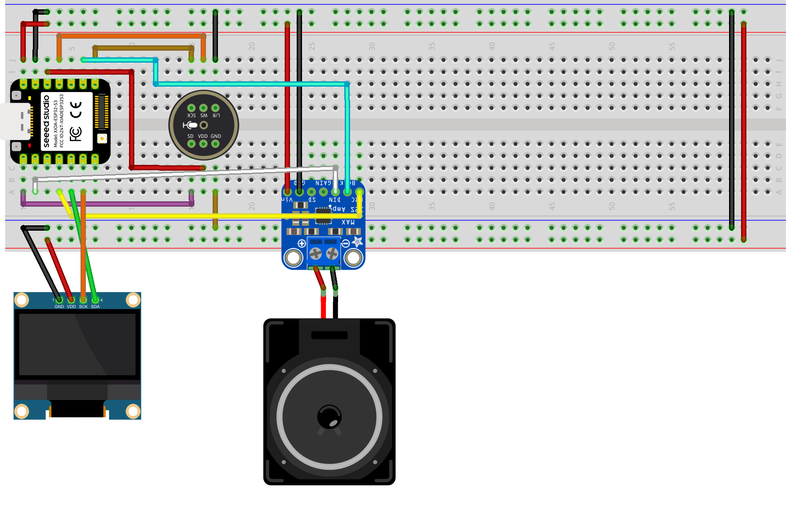
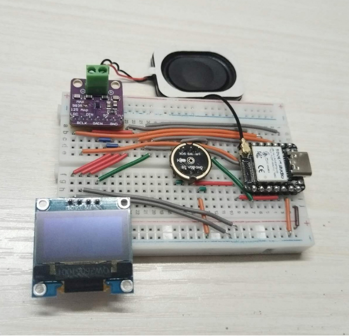

# 🤖 Pocket AI Bot

**A compact, voice-powered AI companion you can take anywhere.** Built with the Seeed Studio **XIAO ESP32-S3** and the open-source **[XiaoZhi AI](https://github.com/78/xiaozhi-esp32)** ecosystem.

Say the wake word, ask a question, and Pocket AI Bot answers through its speaker while its OLED face reacts.

> Built by Cambodian graduate students in Electronic Information for the **National Holiday AI Competition**.

---

## ✨ Features

|     | Feature                  | What it does                                                                   |
| --- | ------------------------ | ------------------------------------------------------------------------------ |
| 🎙️  | **Wake word**            | Hands-free activation, detected offline on the chip (Espressif ESP-SR WakeNet) |
| 💬  | **Natural conversation** | Ask questions or just chat; the reply streams back as speech                   |
| 🧠  | **Conversation memory**  | Keeps short-term context for more natural follow-ups                           |
| 🌏  | **Multilingual**         | English and Chinese voice interaction                                          |
| 🌦️  | **Live info**            | Ask about the weather or the time (NTP time sync)                              |
| 📶  | **Wi-Fi diagnostics**    | Ask for its IP address or Wi-Fi signal strength                                |
| 🔊  | **Volume control**       | Adjust the speaker volume by voice                                             |
| 😊  | **Voice face toggle**    | Switch the OLED between face and text mode by voice                            |
| 🎵  | **Music playback**       | Play music with voice commands                                                 |

## 🛠️ How It Works

The device does the listening; the cloud does the thinking.

```
 ┌──────────────── DEVICE (XIAO ESP32-S3) ────────────────┐
 │  🎙️ INMP441 ──I2S──▶ Wake word (offline, ESP-SR)        │
 │                         │ wake!                        │
 │                         ▼                              │
 │              16 kHz audio → Opus encode ──────────────┼──▶ Wi-Fi
 │                                                        │    (WebSocket / MQTT+UDP)
 │  🔊 Speaker ◀── MAX98357A ◀──I2S── Opus decode ◀───────┼──◀
 │  🖥️ SSD1306 OLED ◀──I2C── status / face / text         │
 └────────────────────────────────────────────────────────┘
                                   │
                                   ▼
 ┌──────────────────── XIAOZHI SERVER ────────────────────┐
 │  VAD → ASR (speech→text) → LLM (e.g. Qwen, DeepSeek)  │
 │      → TTS (text→speech), streamed back sentence by    │
 │        sentence                                        │
 └────────────────────────────────────────────────────────┘
```

1. **Wake:** the microphone streams audio to the ESP32-S3, where the wake-word engine listens continuously and offline.
2. **Listen:** after the wake word, audio is compressed with Opus and sent over Wi-Fi to the XiaoZhi server.
3. **Think:** the server turns speech into text, sends it to the LLM, and turns the reply back into speech.
4. **Answer:** the reply streams back, is decoded on the device, and plays through the MAX98357A amplifier and speaker. The OLED shows status and expressions.

## 🧩 Hardware

| Component     | Part                                         | Purpose                                                |
| ------------- | -------------------------------------------- | ------------------------------------------------------ |
| 🧠 Controller | Seeed XIAO ESP32-S3 (8 MB flash, 8 MB PSRAM) | Audio processing, wake word, Wi-Fi, peripheral control |
| 🎙️ Microphone | INMP441 (I2S MEMS)                           | Voice input                                            |
| 🔊 Amplifier  | MAX98357A (I2S class-D)                      | Drives the speaker                                     |
| 📢 Speaker    | 8 Ω small speaker                            | Voice output                                           |
| 🖥️ Display    | SSD1306 0.96" OLED (I2C)                     | Status, face and text                                  |
| 🔌 Misc       | Breadboard, Dupont jumpers, USB-C cable      | Prototype wiring and power                             |

### 📌 Pin Assignments

| Signal          | Module pin       | XIAO pin | ESP32-S3 GPIO  |
| --------------- | ---------------- | -------- | -------------- |
| Mic word select | INMP441 `WS`     | D0       | GPIO1          |
| Mic data        | INMP441 `SD`     | D1       | GPIO2          |
| Mic clock       | INMP441 `SCK`    | D8       | GPIO7          |
| Mic channel     | INMP441 `L/R`    | GND      | (left channel) |
| Amp data        | MAX98357A `DIN`  | D2       | GPIO3          |
| Amp bit clock   | MAX98357A `BCLK` | D3       | GPIO4          |
| Amp word select | MAX98357A `LRC`  | D6       | GPIO43         |
| OLED data       | SSD1306 `SDA`    | D4       | GPIO5          |
| OLED clock      | SSD1306 `SCL`    | D5       | GPIO6          |

**Power:** INMP441 → 3V3 · MAX98357A → 5V · all grounds common.
The microphone and amplifier use **two separate I2S buses** (the ESP32-S3 has two I2S peripherals).

> ⚠️ Run the OLED from **3V3** if your module pulls SDA/SCL up to its supply, because the ESP32-S3 GPIOs are not 5 V tolerant.

### 📷 Circuit

| Breadboard diagram                                        | Prototype                               |
| --------------------------------------------------------- | --------------------------------------- |
|  |  |

KiCad schematic: [`hardware/AIChatBotwithWakeNet.kicad_sch`](hardware/) (KiCad 10) · [PDF](docs/images/schematic.pdf)

## 🚀 Getting Started

1. **Flash the ESP32-S3** with the XiaoZhi firmware ([xiaozhi-esp32](https://github.com/78/xiaozhi-esp32)), configured for the pin map above.
2. **Connect to Wi-Fi.** On first boot the device opens a setup hotspot. Join it from your phone and enter your Wi-Fi credentials.
3. **Set it up in the XiaoZhi console.** The device shows an activation code. Add the device at [xiaozhi.me](https://xiaozhi.me) and choose its name, wake word and voice.
4. **Update the firmware** over the air when needed.
5. **Start chatting!** Say the wake word and talk to your pocket AI companion.

### Building from source

Requires **ESP-IDF v5.4+**.

```bash
git clone https://github.com/78/xiaozhi-esp32.git
cd xiaozhi-esp32
idf.py set-target esp32s3
idf.py menuconfig        # select the board config / set the pins above
idf.py build
idf.py -p <PORT> flash monitor
```

To enter bootloader mode on the XIAO: hold **BOOT**, plug in USB, then release **BOOT**.

## ▶️ Demo

<table>
  <tr>
    <th>🌦️ Ask the weather</th>
    <th>💬 General talk</th>
  </tr>
  <tr>
    <td align="center">
      <a href="https://www.youtube.com/shorts/sKnOnTCmK2Y">
        
      </a>
    </td>
    <td align="center">
      <a href="https://www.youtube.com/shorts/vj4gSDw4yzM">
        
      </a>
    </td>
  </tr>
</table>

> ▶️ Click a thumbnail to watch on YouTube. Can't open YouTube? The same videos are in the [`video/`](video/) folder: [weather.mp4](video/weather.mp4) · [general.mp4](video/general.mp4)

## 📚 Documentation Site

The project documentation is a single, self-contained HTML page with no build step and no dependencies.

```bash
# Option 1: open the file directly in your browser
open index.html

# Option 2: serve it locally
python3 -m http.server 8000
# then visit http://localhost:8000
```

Features: sidebar navigation, "On this page" table of contents with scroll tracking, light/dark theme, search (`Ctrl + K`), responsive mobile menu, and a language selector (English / ខ្មែរ / 中文; translations in progress).

## 📁 Project Structure

```
.
├── README.md
├── index.html              # Documentation site
├── hardware/               # KiCad 10 project (schematic, PCB)
└── docs/
    └── images/             # Schematic, breadboard diagram, photos, demo media
```

## 🗺️ Roadmap

- [x] Breadboard prototype working with XiaoZhi
- [x] Wake word, conversation, weather and time demos
- [ ] Add the battery: 3.7 V LiPo on the XIAO `BAT+`/`BAT−` pads, power switch, battery-level readout
- [ ] Design a compact custom PCB and a 3D-printed pocket enclosure
- [ ] Custom XiaoZhi board config in this repo, with battery level on the OLED
- [ ] Custom "Pocket Bot" wake word
- [ ] Complete the Khmer and Chinese translations of the docs

## 👥 Team

| Member             | Role  |
| ------------------ | ----- |
| Puthiponareay SARI | _TBD_ |
| Thavin VOEUN       | _TBD_ |
| Kanha NHANH        | _TBD_ |
| Seara SAM          | _TBD_ |
| Laytong LY         | _TBD_ |
| Visai HOEUN        | _TBD_ |

Graduate students in Electronic Information.

## 🙏 Acknowledgements

- [XiaoZhi AI / xiaozhi-esp32](https://github.com/78/xiaozhi-esp32): firmware and voice-assistant ecosystem
- [Espressif ESP-SR](https://github.com/espressif/esp-sr): offline wake-word engine
- [Seeed Studio XIAO ESP32-S3](https://wiki.seeedstudio.com/xiao_esp32s3_getting_started/)

## 📄 License

_Add your license here (for example, MIT)._
